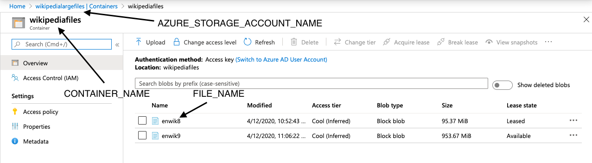

# Examples
***
## top_word_count.py
### Overview
This script reads in a file from an Azure blob storage container and returns the 100 most
 frequent words in that file, the time taken to perform the operation as well as the number of
  unique words in the file.
 
 1. First download a large text file such as this [wikipedia dump](http://mattmahoney.net/dc/textdata.html)
 2. Set up an Azure storage container using these [instructions](https://docs.microsoft.com/en-us/azure/storage/blobs/storage-quickstart-blobs-portal)
 3. Upload your large text file to the storage 
 4. Submit the top_word_count job to your spark cluster from inside the docker_submit container
  using the following syntax from inside the examples/python_scripts folder (change the spark
  .executor.cores and spark.executor.memory to appropriate values for your cluster).
    ``` 
    $SPARK_HOME/bin/spark-submit --master spark://spark-master:7077 --conf spark.executor.memory=10G
    --conf spark.executor.cores=3 top_word_count.py AZURE_STORAGE_ACCOUNT_NAME
    AZURE_STORAGE_ACCCUNT_ACCESS_KEY CONTAINER_NAME FILE_NAME 
    ```
    
    Your account storage name, container name and file name are as shown in the screenshot below
    
    Your access key will be under the 'Access keys' tab of your storage account's homepage.
5. To compare this to using a single core for the same operation use the following command
    ``` 
    $SPARK_HOME/bin/spark-submit --master local[1] --conf spark.executor.memory=10G
        --conf spark.executor.cores=1 top_word_count.py AZURE_STORAGE_ACCOUNT_NAME
        AZURE_STORAGE_ACCCUNT_ACCESS_KEY CONTAINER_NAME FILE_NAME
   ```
   
   changing the spark.executor.memory to something more appropriate for the single machine.
   
