# Docker-Spark-Tutorial
This repo is intended to be a tutorial walkthrough in how to set up and use a Spark cluster running inside Docker containers. 

I assume some familiarity with Docker and its basic commands such as build and run. Everything else will be explained in this file.

We will build up the complexity to eventually a full architecture of a Spark cluster running inside of Docker containers in a 
sequential fashion so as to hopefully build the understanding. The table of contents below shows 
the different architectures we will work through.

***
## TABLE OF CONTENTS
* [Create Docker images](#create-docker-images)
    * [Building images from scratch](#building-images-from-scratch)
    * [Pulling images from repository](#pulling-images-from-repository)
* [Docker networking](#docker-networking) 
  * [Containers on single machine](#containers-on-a-single-machine)
  * [Containers on different machine](#containers-on-different-machines)
* [Apache Spark](#apache-spark)
    * [Spark cluster - local machine](#spark-cluster---local-machine)
* [Docker &  Apache Spark](#docker-&-apache-spark)
    * [Local Machine](#local-machine)
        * [Spark Cluster](#spark-cluster-&-docker-containers)
        * [Architecture](#spark-&-docker-architecture)
    * [Multiple Machines](#multiple-machines)
        * [Spark Cluster](#spark-cluster)
        * [Architecture](#architecture)
        
  
***
## Create Docker images

#### Building images from scratch
If you wish to build the Docker images from scratch clone this repo.

Next, run the following commands
```
docker build -f Dockerfile_base -t {YOUR_TAG} .
docker build -f Dockerfile_master -t {YOUR_TAG} .
docker build -f Dockerfile_worker -t {YOUR_TAG} .
docker build -f Dockerfile_submit -t {YOUR_TAG} .
```
and then you may wish to push these images to your repository on Docker or somewhere else 
using the 'Docker push' command.

#### Pulling images from repository
Alternatively, you can pull the pre-built images from my repository. Simply run
the following commands
```
docker pull sdesilva26/spark_master:latest
docker pull sdesilva26/spark_worker:latest
docker pull sdesilva26/spark_submit:latest
```
*NOTE: You do not need to pull sdesilva26/spark_base:0.0.1 because, as the name suggests,
this image is used as a base image for the other two images and so is not needed on your machine.*

***
## Docker networking

Now let's see how to get the containers communicating with each other. First
we shall show how to do when the containers are running on the same machine and
then on different machines.

### Containers on a single machine

Most of the following is taken from Docker's website in their section 
about [networking with standalone containers](tutorial.md#https://docs.docker.com/network/network-tutorial-standalone/).

Docker running on your machine under the hood starts a Docker daemon which interacts
with tthe linux OS to execute your commands.(*NOTE: if you're running Docker on a 
non-linux host, docker actually runs a VM with a linux OS and then runs the Docker
daemon on top of the VM's OS.*)

By default, when you ask the Docker daemon to run a container, it adds it to the
default bridge network called 'bridge'. You can also define a bridge network yourself.

#### Deafult bridge network
We will do both. First let's use the default bridge network. Let's also run a container
with the image for the Spark master and also one for the Spark worker. Our architecture therefore
looks like the figure below. 

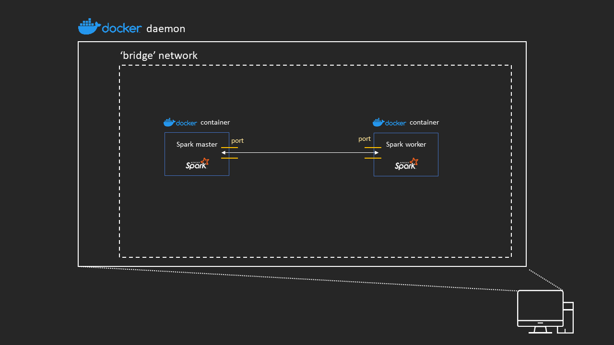

Start the two containers up using
```
docker run -dit --name spark-master --entrypoint /bin/bash sdesilva26/spark_master
docker run -dit --name spark-worker --entrypoint /bin/bash sdesilva26/spark_worker
```
The d flag means to run the container dettached, so in the background, the i flag
indicates it should be interactive so that we can type into it, and the t flag specifies 
the container should be started with a TTY so you can see the input and output.

Check that the containers have started using 
```
docker container ls
```
and you should get something similar to

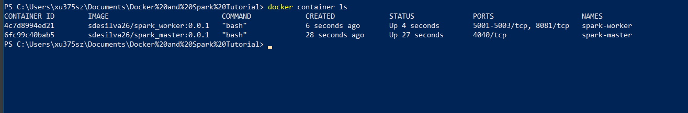

You can see which containers are connected to a network by using
```
docker network inspect bridge
```
and you should see something similar to the following

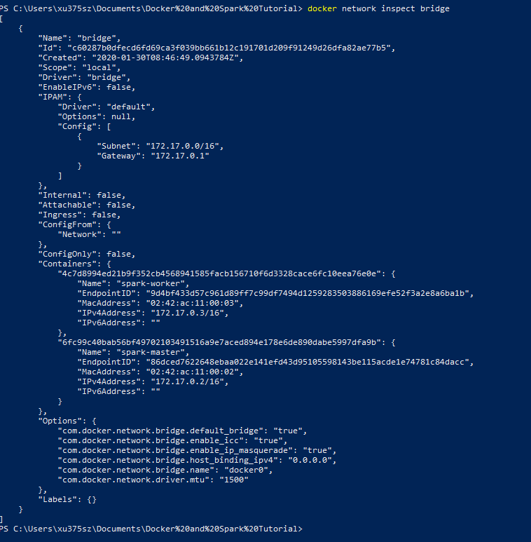

Attach to the spark-master container using
```
docker attach spark-master
```
You should the prompt to change now to a # which indicates that you are
the root user inside of the container.

Get the network interfaces as they look from within the container using
```
ip addr show
```
The interface with the title starting with 'eth0"' should display that
this interface has the same IP address as what was shown for the spark-master
container in the network inspect command from above.

Check internet connection from within container using
```
ping -c 2 google.com
```
Now ping spark-worker container using its IP address from the network
```
ping -c 2 172.17.0.3
```
If you know ping by container name it will familiarity
```
ping -c 2 spark-worker
```
Now dettach from spark-master whilst leaving it running by holding down
ctl and hitting p and then q.

#### User-defined bridge network

Create the user-defined bridge network
```
docker network create --driver bridge spark-network
```
Then list the networks
```
docker network ls
```
and you should see

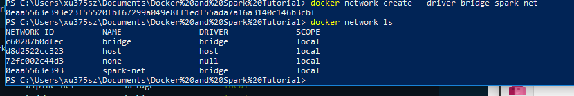

and now inspect the network
```
docker network inspect spark-net
```

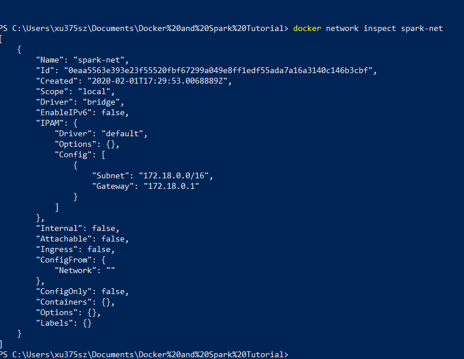

The IP address of the network's gateway should now be different to the IP address
of the default gateway. It should also show that no containers are attached to it.

Now stop the two running containers, remove them, then create two new containers
that are attached to the new user-defined network.
```
docker kill spark-master spark-worker
docker rm spark-master spark-worker

docker run -dit --name spark-master --network spark-net --entrypoint /bin/bash sdesilva26/spark_master
docker run -dit --name spark-worker1 --network spark-net --entrypoint /bin/bash sdesilva26/spark_worker
```
*NOTE: you can only connect to a single network when creating a docker container. But you
can attach it to more networks after using the 'docker network connect <NETWORK_NAME> <CONTAINER_NAME>'
command.*

Again make sure the containers are running and inspect the network to make sure they
have successfully attached to the spark-net network.

The advantage of user-defined networks is as before containers can communicate via
IP address in the network, but they can also resolve a container name to its IP
address in the network now (this is called 'automatic service discovery').

Attach to spark-master and ping spark-worker using its IP address and also its
container name.
```
docker container attach spark-master

ping -c 2 172.18.0.3
ping -c 2 spark-worker
```

Detach from the container using ctl followed by p and then q. 

In the tutorial linked at the start of this section they go through the case of having
a container in a user-defined network AND the bridge network. It can obviously communicate
with the two containers in spark-net for instance. It could also communicate with a 
container inside just the bridge network but it would have to ping it using its IP
address as specified in the bridge network.


### Containers on different machines

For this section most of this will be following the instructions from Docker's
website about using an [overlay network for standalone containers](tutorial.md#https://docs.docker.com/network/network-tutorial-overlay/).

If you have two different machines then the following section can be skipped.

#### Settting up Amazon EC2 instances
Otherwise you will need to setup at least 2 Amazon EC2 instances (or any other cloud computing provider
you are comfortable with).

1. Go to AWS and select EC2. 
2. Go to launch instance and select *'Amazon Linux AMI 2018.03.0 (HVM),
SSD Volume Type'* (you can us any instance type here, but this configuration worked for me) as the image type.
3. Select t2.micro
4. Set 'Number of instances' to 1 and leave everything else as default
5. Click through to 'Configure Security Group' and select 'Create a new security group'
6. As detailed in Docker's tutorial, 'Each host must have,.... the following ports open
 between the two Docker hosts:

    - TCP port 2377
    - TCP and UDP port 7946
    - UDP port 4789

If you’re using AWS or a similar cloud computing platform, the easiest configuration is
to use a security group that opens all incoming ports between the two hosts and the 
SSH port from your client’s IP address.'
7. Launch the instance and associate a key with your instances.

8. Now go through the same procedure but instead of selecting t2.micro, select c4.xlarge and launch 2 of these
instances. This will be helpful for later on when we really want to show off the power of spark.

Now that you have launched your ec2 instance you need to install docker. To do this
type the following
```
sudo yum install docker -y

sudo service docker start

sudo docker run hello-world

```
To avoid having to use sudo all the time follow these [instructions](#https://github.com/sindresorhus/guides/blob/master/docker-without-sudo.md)
and then disconnect from your instance and connect back to it again. You should now
be able to run Docker commands without sudo.

Finally login to your repo and pull the spark_master and spark_worker image, one into each of the
instances.

For example, on instance 1
```
docker pull sdesilva26/spark_master:latest
```

and on instance 2,
```
docker pull sdesilva26/spark_worker:latest
```

You're all set to go!

#### User-defined overlay network

Now that you have two separate machines running Docker that are on the same network
you have an architecture like this


There is two instances running Docker inside of the same subnet
which is itself inside of your personal bit of the Amazon cloud
called a virtual private cloud (VPC).

We want to create a network that encapsulates both Docker containers. To do
this we will first create a Docker swarm, which essentially links the daemons together,
and then we will create an overlay network and put our containers in that network.

Set up a Docker daemon to be the swarm manager by running in one of the ec2 instances the following
```
docker swarm init
```

You should see something similar to


The IP address and port that is shown from this command is referring to the IP and port of the host machine that
the Docker daemon is running on. Hence the IP address should match the private IP address of your ec2 instance.
Check this in the ec2 dashboard.

You can now join the second ec2 instance to the swarm by running
```
docker swarm join --token <YOUR_TOKEN> <YOUR_PRIVATE_IP>:2377
```

Once this is complete your architecture is now


Now create an attachable overlay network using
```
docker network create --driver overlay --attachable spark-overlay-net
```

Jump into the spark-master container and also connect it to the overlay network
```
docker run -it --name spark-master --network spark-overlay-net --entrypoint /bin/bash sdesilva26/spark_master:latest
```

On your other instance, list the networks available
```
docker network ls
```
and notice that the spark-overlay-net is not there yet.

Start a spark-worker container that connects to the network
```
docker run -dit --name spark-worker --network spark-overlay-net --entrypoint /bin/bash sdesilva26/spark_worker:latest
```
Now you should see the spark-over-net if you check the networks on your second instance.
Check that it also has the same network ID has displayed in your first instance.

The containers are now in the same overlay network and the architecture looks like


Now ping spark-worker from spark-master
```
ping -c 2 spark-worker
```
and similarly from spark-worker
```
ping -c 2 spark-master
```

You're containers can successfully communicate over the overlay network!

You must stop and remove the containers on each instance independently because
Docker daemons operate independently and these are standalone containers. 
You only have to remove the network on instance 1 because when you stop spark-worker
 on instance 2, spark-overlay-net disappears.
 
 ***
 ## Apache Spark
 Now lets see how to set up a Spark cluster and perform distributed computation using this
 cluster. In the first part of this section, as in the 'Docker networking' section I will
 describe how to do this on your local machine. In the second half I will move on to describe how
 to set up a distributed Spark cluster with each worker and the master node on different hosts.
 
 ### Local Machine
 
 #### Spark cluster
 1. Go to the bin directory of you spark installation using the command line. 
 It will be something like 
 "spark-2.4.3-bin-hadoop2.7/bin" and type the following to set up a master node
     ```
    spark-class org.apache.spark.deploy.master.Master
    ```
    this should print out that you have started the service 'sparkMaster' along with the port. 

2. Go to your browser and navigate to the Master node UI
    ```
    http://<IP_ADDRESS>:8080
    ``` 
    or
    ```
    http://localhost:8080
    ``` 

    you should see something like
    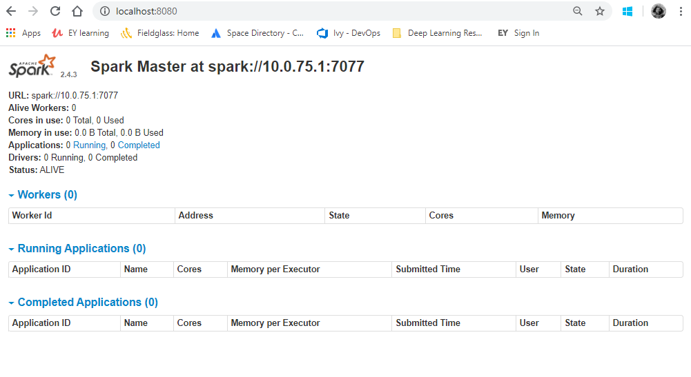

3. Open a new command line shell and again navigate to the bin directory and use the following
to attach a worker to the Master node

    ```
    spark-class org.apache.spark.deploy.worker.Worker -c 2 -m 10g -p 7078 spark://<IP_ADDRESS>:7077
    ```
    The flags in the above command specify to attach a worker with 2 cores, 10GB of memory on port 7078
    of the network to a spark master node which is at the address <IP_ADDRESS>:7077.

4. Again check your Master node UI and see that the worker has been attached. Also go to 
the UI for the worker. This info should have been returned to the console when you attached 
the worker to the master node. By default the UI will try to attach to port 8080, if it fails
it will try port 8081, and repeat this process until a free port is found. You should see the
following
    
    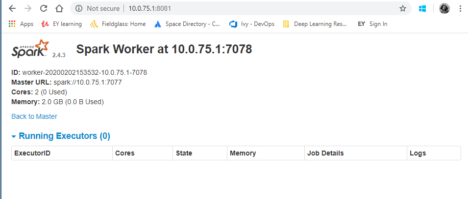
    
 5. Open a new command line console and perform a simple job on the cluster. Use
    ```
    spark-2.4.3-bin-hadoop2.7/bin/spark-shell --master spark://localhost:7077
    ```
    to open a scala shell. Then type
    ```
    val NUM_SAMPLES=10000
    var count = sc.parallelize(1 to NUM_SAMPLES).filter { _ =>
      val x = math.random
      val y = math.random
      x*x + y*y < 1
    }.count() * 4/(NUM_SAMPLES.toFloat)
    ```
    and you should see the console return an estimation of pi.
6. Navigate to the application UI. This information is printed to the console
when starting up the scala shell. It will be http://<IP_ADDRESS>:4040. It uses
4040 by default and increments by 1 and retries if port is already taken. You
should see something similar to

    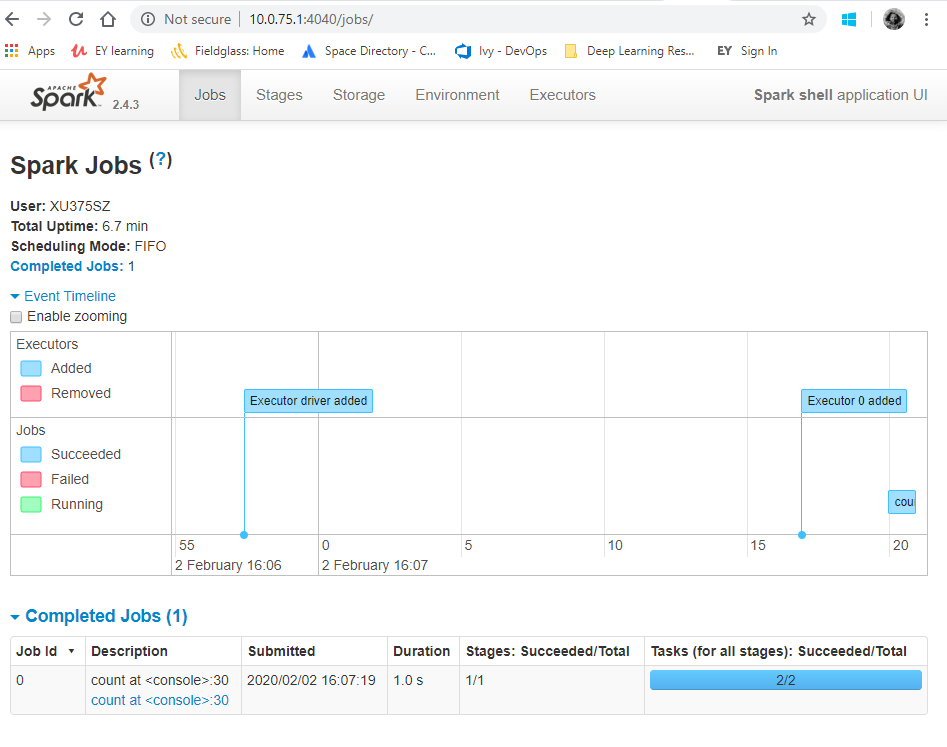
    
 Your Spark cluster is now complete on your local machine.
 
 ## Docker & Apache Spark
 ### Local machine
 
 This whole section will detail how to setup an Apache Spark cluster running inside Docker containers
 on your local machine. The second half of this section will detail the architecture of this to help the
 user in understanding the layout and the advantage of running everything inside of Docker containers.
 
 #### Spark cluster 

Now we are going to use spark running inside of containers to set-up a cluster. To do this we will 
create a user-defined bridge network as we did in the previous section.

1. Create user defined bridge network inside of Docker using (if you haven't already) 
    ```
   docker create network -d bridge spark-net 
   ```
2. Create a spark-master container inside of the bridge network
    ``` 
   docker run -dit --name spark-master --network spark-net -p 8080:8080 sdesilva26/spark_master bash
   ```
   
   *NOTE: by default the container will start up a spark master node. To override this behaviour simply pass -entrypoint
    /bin/bash to the docker run command*
    
3. Then connect to the running container 
    ``` 
   docker attach spark-master
   ```
 4. You should now be able to see the Master web UI by going to http://localhost:8080 or http
 ://<YOUR_IP_ADDRESS>:8080.
 
 5. Run a worker container
    ``` 
    docker run -dit --name spark-worker1 --network spark-net -p 8081:8081 -e MEMORY=2G -e CORES=1
      sdesilva26/spark_worker bash
    ```
    *NOTE: the flags CORES and MEMORY specify how many cores and how much memory on the machine
     that the container is running in should the worker take. By default they are set to 3 and 6G
    if nothing is passed.*
    
7. Attach to the running spark-worker
    ``` 
   docker attach spark-worker1 
   ```
8. Verify the worker has connected to the cluster by going to http://localhost:8080 and http
://localhost:8081 
(worker web UI)

9. Start a second worker
    ``` 
    docker run -dit --name spark-worker2 --network spark-net -p 8082:8081 -e MEMORY=2G -e CORES=1
    sdesilva26/spark_worker bash
    ```
    
    The flag -p 8082:8081 now maps the exposed 8081 port of the docker container to the unassigned 8082 port of
    the host machine 
    
11. Again, verify your worker was successfully added by navigating to the Master web UI and also the second workers
web UI http://localhost:8082.

12. Spin-up a spark_submit container
    ``` 
    docker run -it --name spark-submit --network spark-net -p 4040:4040 sdesilva26/spark_submit bash
    ```
    
    This container will act as our driver node, i.e. from where the main() method of your programs will run.
    
13. From within the container jump into a scala shall using
    ``` 
    $SPARK_HOME/bin/spark-shell --conf spark.executor.memory=2G --conf spark.executor.cores=1
    --master spark://spark-master:7077 
    ```
    
    This command connects the driver to the cluster by specifying the address of the master node
    . Notice the name of the container running the spark master node is used (i.e. "spark-master" in the above command) to specify the IP address of the master node. The two --conf flags
     specify how many cores an executor on the cluster should get and how much memory each
     executor should get. See the later section on Spark tuning for more info on the difference
     between spark workers and executors.
    
14. If the driver connects successfully go to http://localhost:4040 to check the driver web UI.
15. Run an example spark job by typing in the scala shell
    ``` 
    val myRange = spark.range(10000).toDF("number")
    
    val divisBy2 = myRange.where("number % 2 = 0")
    
    divisBy2.count()
    ```
16. Go back to the driver web UI and you should see something similar to 

    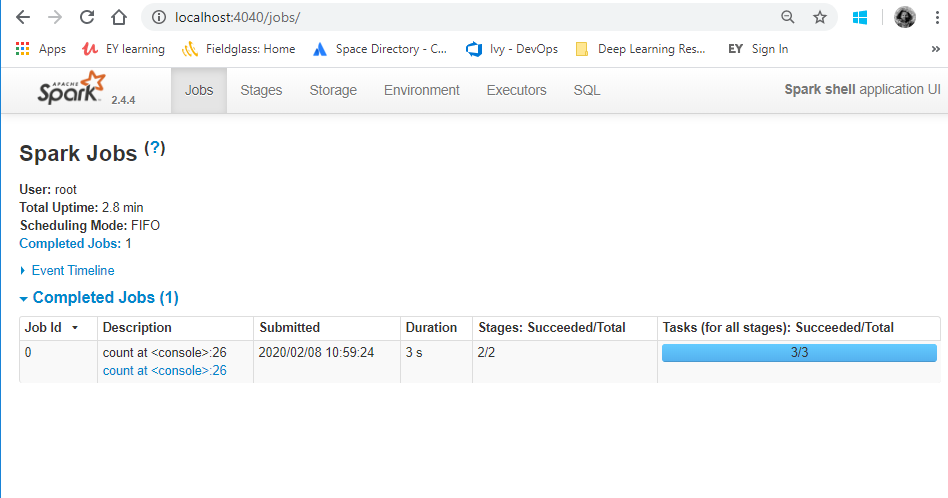
    
    where you can see info about the job that was run, the stages completed and the tasks completed.
    The tabs at the top allow you to get more info about the cluster configuration.
    
    
You have now submitted and run a spark job where the spark cluster is operating inside Docker containers.

#### Architecture

You can skip this section, however I would advise going through it to gain a better understanding of why we are able
to map certain ports to the machine's ports and use Docker network's automatic DNS resolution.

The architecture we have just created, before adding the driver node, looks like this

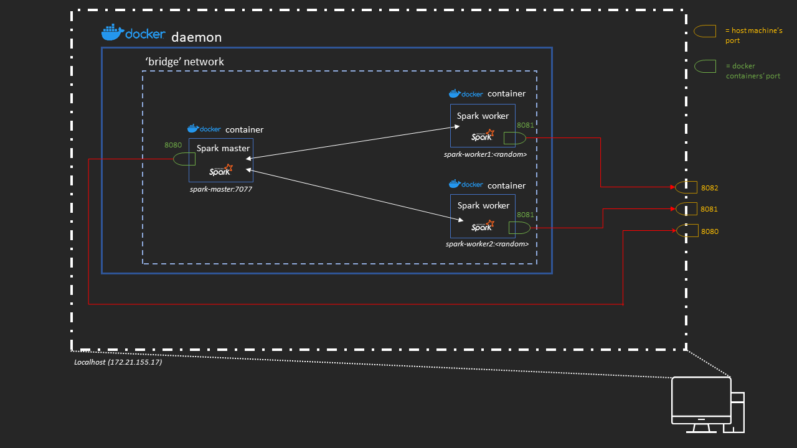

From Docker's [documentation](#https://docs.docker.com/config/containers/container-networking/) they say
 
'The type of network a container uses, whether it is a bridge, an overlay, a macvlan network,
 or a custom network plugin, is transparent from within the container. From the container’s 
 point of view, it has a network interface with an IP address,... '.
 
 This IP address that the container is situated at is resolvable by other containers within the same network
 by simply referring to the container's name, e.g. spark-master is the same as giving the IP address that Docker
 assigns to the spark-master container.
 
 Furthermore, when we run an image to create a container and make a port mapping such as -p 8080:8080 we 
 are really saying 'connect the port at <HOST_IP_ADDRESS>:<HOST_PORT> to the container port at 
 <DOCKER_IP_ADDRESS>:<DOCKER_PORT>' (red lines in the above image). This is why we can expose the same port on 
 replica containers (such as 8081 in the spark-worker containers) but they **must** be mapped to different 
 ports on the host machine as obviously the host only has one port 8081 at a certain IP address.
 
 Then we added in the spark-submit container. Why run this inside the bridge network? The basic architecture of Spark
 (with no Docker containers) is as follows
 
 
 
 The driver program, which in our case is inside the spark-submit node, needs to be able to communicate back and
 forth with both the master and worker nodes. Therefore, if we placed the spark-submit node outside of the Docker network
 , and even worse, outside of Docker, we would have a lot of headaches having to map different Docker container
 ports to the appropriate place on the host machine, and then specify these ports for the driver program. This 
 is not impossible, but made hard and tedious by the fact that I believe the driver chooses random ports to
 communicate with the workers. You could set this property in the spark config file but this seems to be unnecessary
 work. 
 
 Therefore, we have placed the driver program within Docker and furthermore we are running the driver
 from within a container that is attached to the spark-net network. We have also mapped it's port 4040
 to the host machine's port 4040 to view the web UI.
 
 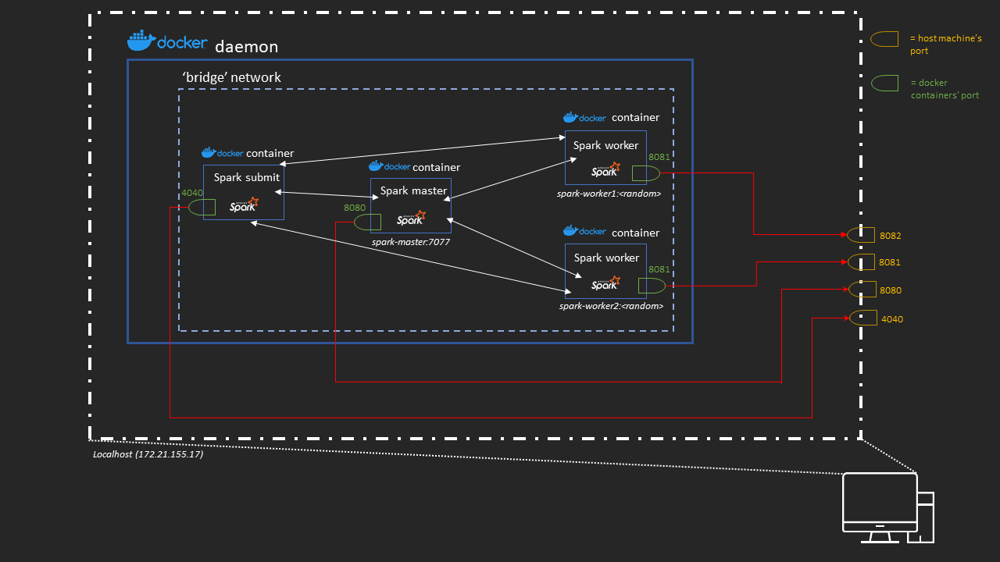

Now we simply pass the address of the master node when we set up a spark program within the spark-submit container
and from there it is freely able to resolve and communicate with the nodes in that cluster.

 ### Multiple machines
 Now we can finally bring everything together to show what we would really like to do which is run 
 an Apache Spark cluster within Docker containers on different machines.
 
 #### Spark Cluster
 
 1. Start up 4 different EC2 instances and on the first run
    ```
    docker swarm init
    ``` 
 2. As before, you will see a join token, copy and paste this command into the other 3 EC2
  instances to form a docker swarm. 
  
 3. Then on the t2.micro instance create the overlay network
    ``` 
    docker network create --driver overlay --attachable spark-net
    ```
 3. Run a spark_master image to create a container that will be the master node
    ``` 
    docker run -it --name spark-master --network spark-net -p 8080:8080 sdesilva26/spark_master
    :latest
    ```
    *NOTE: it is important to remember the name of this container (spark-master in this case) as this is what
    other containers in the network will use to resolve its IP address.

 4. Check the master node has been setup correctly by going to http://<PUBLIC_IPv4_ADDRESS_OF_INSTANCE>:8080.
 
 5. Now on the larger AWS instances (c4.xlarge) create one container on each by using
    ``` 
    docker run -it --name spark-worker1 --network spark-net -p 8081:8081 -e MEMORY=6G -e
     CORES=3 sdesilva26/spark_worker:latest
    docker run -it --name spark-worker2 --network spark-net -p 8081:8081 -e MEMORY=6G -e
     CORES=3 sdesilva26/spark_worker:latest
    ```
    NOTE: You can map port of the container to the port of the host machine without having to
     increment them like we did when doing this on our local machine as they are located on
      different host's. See the architecture diagram in the next section for more info.
      
 6. Check the master web UI at http://<PUBLIC_IP_ADDRESS_OF_INSTANCE>:8080 to make sure the
  workers were added successfully.
  
 7. Now in a third AWS instance create a spark-submit container
    ``` 
    docker run -it --name spark-submit --network spark-net -p 4040:4040 sdesilva26/spark_submit
    :latest bash
    ```
 10. Launch a spark shell using
    ``` 
    $SPARK_HOME/spark/bin/spark-shell --conf spark.executor.cores=3 --conf spark.executor.memory=6G
     spark
    ://spark-master:7077
    ```
 11. Now, as before, run a test program such as 
 
    ```
    val myRange = spark.range(100000).toDF("number")
    
    val divisBy2 = myRange.where("number % 2 = 0")
    
    divisBy2.count()
    ```
    
    You should get a result back to the console. Furthermore, you should be able to check the driver 
    by going to the IP address of the container that spark-submit is running on and specifying port 4040.
    *NOTE: The more common way of submitting jobs to the cluster is to use the spark-submit script. For example,
        ```
        ./bin/spark-submit \
          --master spark://spark-master:7077 \
          examples/src/main/python/pi.py \
          1000
        ``` 
    
 That is it as far as connecting up a Spark cluster running in Docker containers is concerned. The next section will
 briefly go over the architecture we have set up in this section.
 See the "Spark Tuning" page for info about spark executors, workers, tasks, jobs, stages, etc.
 
 #### Architecture
 What we have set up in the previous section is the following architecture: 
 
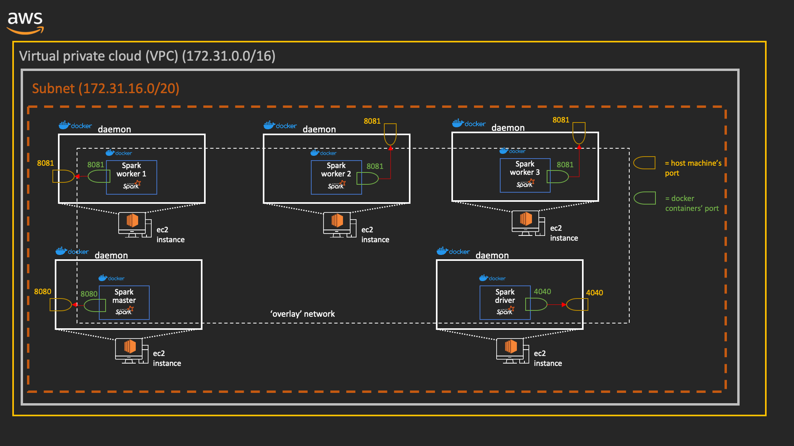

All of the machines involved in the cluster sit inside the overlay network which we called spark
-net. This allows for each container to automatically resolve the addresses of other containers
 in the overlay network. This makes communication between the various nodes in the cluster easy
  as all the ports are exposed within the overlay network. If the containers did not sit in the
   same overlay network we would need to expose every single port which could be used for
    communication.
    
Each of the 8081 ports on the workers can now also be mapped to their host machine's 8081 port
 since unlike when we set up the cluster inside docker containers on our local machine, there is
  now a port 8081 on each of the host machines. 
  
  The above diagram illustrates why it is important that all the EC2 instances be deployed into
   the same subnet within AWS. If they are not I think linking them into a Docker swarm would be
    more troublesome.